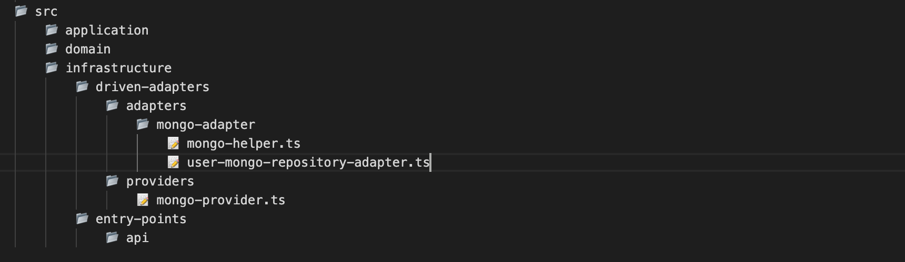
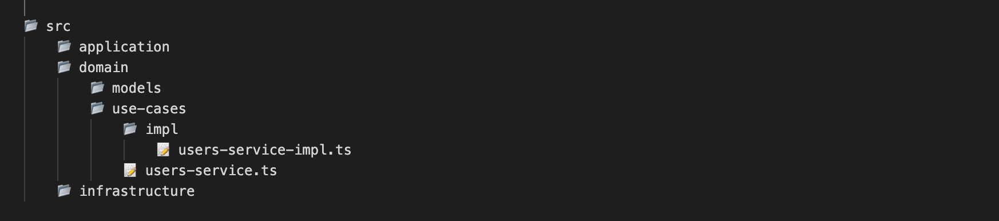

# Clean Architecture Scaffold

Este CLI crea la estructura de un proyecto de NodeJs y TypeScript basado en arquitectura limpia para construir  API RESTful, viene con la configuración inicial de una aplicación de Express como framework de NodeJs y esta se encuentra en la **`capa de application`**.

- [Clean Architecture Scaffold](#clean-architecture-scaffold)
- [Implementación del plugin](#implementación-del-plugin)
- [Tareas](#tareas)
  - [Generar proyecto](#generar-proyecto)
  - [Generar Base de datos](#generar-base-de-datos)
  - [Generar Modelo](#generar-modelo)
  - [Generar Interface](#generar-interface)
  - [Generar Servicio](#generar-servicio)
  - [Generar Controlador](#generar-controlador)
  

# Implementación del plugin

Instalamos el plugin de forma global en nuestro equipo, para poder acceder a los comandos que generan
las tareas.

**`npm i -g clean-scaffold`**

# Tareas

## Generar proyecto

1. Generamos la estructura del proyecto con el comando **`scaffold init`**, el cual recibe dos parámetros
    **`--name`** y **`--express`**.

   - **`--name`** = Nombre del proyecto el cual especificas.

   - **`--express`** = Esta es una bandera que determina que es un proyecto con el framework Express, debe de pasarse como **`true`**. En próximas versiones se podrá generar con otros framework de Nodejs.

   ```shell
   scaffold.ts init --name=[nombre proyecto] --express=true
   ```

**_Estructura que genera el plugin:_**


## Generar Base de datos

1. Generamos el adaptador con la configuración inicial de la base de datos para los gestores de base de datos como MongoDB, MySQL o Postgres con el comando **`scaffold create:database`**, 
   recibe un parámetro **`--database`**, este es requerido.

    - **`--database`** = Nombre del gestor de base de datos **`mongo, mysql, postgres`**.

   ```shell
   scaffold.ts create:database --database=[nombre del gestor]
   ```

**_Estructura que genera el plugin:_**



## Generar Modelo

1. El comando **`scaffold create:entity`** generará un modelo y una interfaz  en la **`capa del dominio [models]`**, esta tarea tiene como parámetro **`--name`** y este es requerido.

   - **`--name`** = Nombre del modelo.
    
   ```shell
   scaffold.ts create:entity --name=[nombre del modelo]
   ```

**_Estructura que genera la tarea:_**


## Generar interface

1. El comando **`scaffold create:interface`** genera una interface, la ubicación del archivo es de acuerdo al componente
    donde se requiera. El nombre debe de llevar un guión medio en caso de que sea compuesto.
    Ejemplo: **`--name=user, --name=user-detail, --name=post-comments-user.`**

    - **`--name`** = Nombre de la interface.
    - **`--path`** = Componente donde se crea la interface.
    - **`opciones`** = Ubicacion donde se genera el archivo: models, service, infra.
    
Ejemplo: **`scaffold create:interface --name=user-detail --path=models`**

**_Estructura que genera la tarea:_**


Ejemplo: **`scaffold create:interface --name=user-detail --path=service`**

**_Estructura que genera la tarea:_**


   
Ejemplo: **`scaffold create:interface --name=user-detail --path=infra`**
   
**_Estructura que genera la tarea:_**
   

   
   ```shell
   scaffold.ts create:interface --name=[nombre de la interface] --path=opciones
   ```

## Generar Servicio

1. El comando **`scaffold create:service`** generará la interfaz y el servicio que hace la implementación de esta en la 
   **`capa del dominio [use-cases]`**, esta tarea tiene como parámetro **`--name`** y este es requerido.

   - **`--name`** = Nombre del servicio.

   ```shell
   scaffold.ts create:service --name=[nombre del servicio]
   ```

**_Estructura que genera la tarea:_**



## Generar Controlador

1. El comando **`scaffold create:controller`** generará un controlador en la **`capa de infrastructure`**, 
   esta tarea tiene como parámetro **`--name`** y este es requerido.

   - **`--name`** = Nombre del controlador.

   ```shell
   scaffold.ts create:controller --name=[nombre del controlador]
   ```

**_Estructura que genera la tarea:_**


