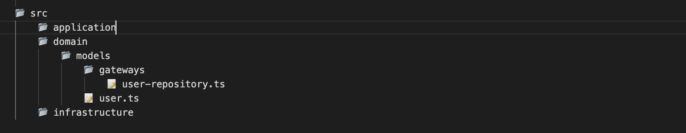
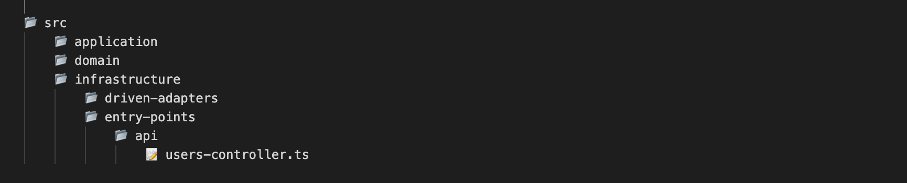

# Clean Architecture Scaffold

This CLI creates the structure of a NodeJs and TypeScript project based on clean architecture to build REST full APIs, it comes with the initial configuration of an Express application as a NodeJs framework and this is located in the **`application layer`**.

- [Clean Architecture Scaffold](#clean-architecture-scaffold)
- [Implementation of the plugin](#implementación-del-plugin)
- [Tasks](#tareas)
  - [Project Generation](#generar-proyecto)
  - [Database Generation](#generar-base-de-datos)
  - [Model Generation](#generar-modelo)
  - [Interface Generation](#generar-interface)
  - [Service Generation](#generar-servicio)
  - [Controller Generate](#generar-controlador)
  

# Implementation of the plugin

We install the plugin globally in our computer, to be able to access the commands that generate the tasks.
the tasks.

**`npm i -g clean-scaffold`**

# Tasks

## Project Generation

1. We generate the project structure with the command **`scaffold init`**, which receives two parameters.
    **`--name`** and **`--express`**.

   - **`--name`** = Name of project you specify.

   - **`--express`** = This is a flag that determines that it is a project with the Express framework, it must be passed as **`true`**. In future versions it will be possible to generate with other Nodejs framework.

   ```shell
   scaffold init --name=[project name] --express=true
   ```

**_Plugin generated structure:_**


## Database Generation

1. We generate the adapter with the initial database configuration for database managers like MongoDB, MySQL or Postgres with the command **`scaffold create:database`**,
   receives a parameter **`--database`**, this is required.

    - **`--database`** = Database manager name **`mongo, mysql, postgres`**.

   ```shell
   scaffold create:database --database=[manager name]
   ```

**_Plugin generated structure:_**


## Model Generation

1. The **`scaffold create:entity`** command will generate a model and an interface in the **`domain layer [models]`**, this task has **`--name`** as parameter and this is required.
   The name must have a middle hyphen in case it is compound.
   Example: **`--name=user, --name=user-detail, --name=post-comments-user.`**

   - **`--name`** = Model name.
    
   ```shell
   scaffold create:entity --name=[model name]
   ```

**_Task generating structure:_**



## Interface Generation

1. The **`scaffold create:interface`** command generates an interface, the location of the file is according to the component where it is required.
   where it is required. The name must have a hyphen in case it is a compound name.
   Example: **`--name=user, --name=user-detail, --name=post-comments-user.`**

    - **`--name`** = Interface name.
    - **`--path`** = Component where the interface is created.
    - **`opciones`** = Location where the file is generated: models, service, infra.
    
Example: **`scaffold create:interface --name=user-detail --path=models`**

**_Structure that generates the task:_**


Example: **`scaffold create:interface --name=user-detail --path=service`**

**_Structure that generates the task:_**


   
Example: **`scaffold create:interface --name=user-detail --path=infra`**
   
**_Structure that generates the task:_**
   

   
   ```shell
   scaffold create:interface --name=[interface name] --path=options
   ```

## Service Generation

1. The **`scaffold create:service`** command will generate the interface and the service that implements it in the **`domain layer [use-cases]`**.
   **`domain layer [use-cases]`**, this task has **`--name`** as parameter and this is required. The name must have a hyphen in case it is a compound name.
   Example: **`--name=user, --name=user-detail, --name=post-comments-user.`**

   - **`--name`** = Service name.

   ```shell
   scaffold create:service --name=[nombre del servicio]
   ```

**_Structure that generates the task:_**


## Controller Generation

1. The **`scaffold create:controller`** command will generate a controller in the **`infrastructure layer`**,
   this task has **`--name`** as parameter and this is required. The name must have a hyphen in case it is a compound name.
   Example: **`--name=user, --name=user-detail, --name=post-comments-user.`**

   - **`--name`** = Controller name.

   ```shell
   scaffold create:controller --name=[controller name]
   ```

**_Structure that generates the task:_**


